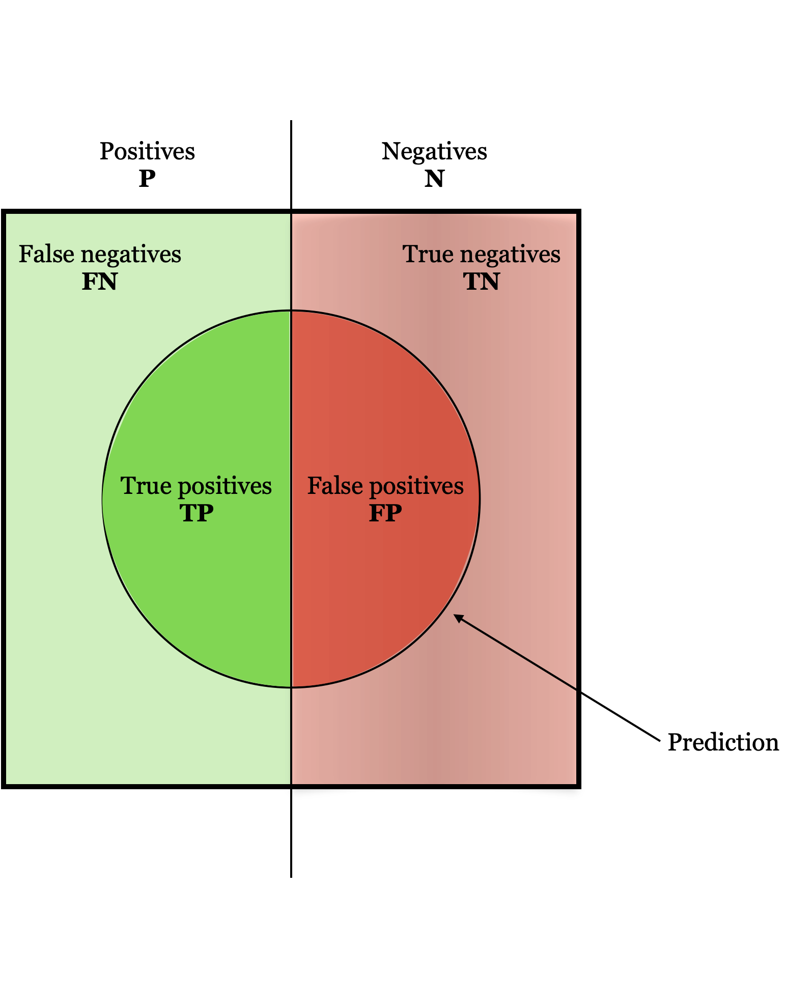

# Performance measures for classification

## Binary classication

### Confusion Matrix

### Metrics

#### Accuracy 

$$ Accuracy = \dfrac{TP + TN}{P + N}$$
#### Precision

$$ Precision = \dfrac{TP}{TP + FP} $$

#### Recall

$$ Recall = \dfrac{TP}{TP + FP} $$

#### F1-Score

F1-Score is the hormonic mean of precision and recall. 
$$F_1 = 2*\dfrac{Precision*Recall}{Precision + Recall}$$